<div align="center">

<picture>
  <source media="(prefers-color-scheme: dark)" srcset="docs/assets/banner-dark.svg">
  
</picture>

### Every review gets an integrity weight. Watch the rating move with it.

Typed AI judgments on every single review, corpus analysis that finds bursts and coordinated groups,<br>
and three ratings side by side: **raw**, **integrity-adjusted** (with a 95% CI) and **the platform's own rules**.

[](https://rating-integrity-engine.vaibhavvs.workers.dev)
[](.github/workflows/ci.yml)


**[▶ Open the live demo](https://rating-integrity-engine.vaibhavvs.workers.dev)** · [How the ratings work](https://rating-integrity-engine.vaibhavvs.workers.dev/help) · [Benchmarks](https://rating-integrity-engine.vaibhavvs.workers.dev/benchmarks) · [Architecture](docs/ARCHITECTURE.md) · [Results](docs/RESULTS.md)

<br>

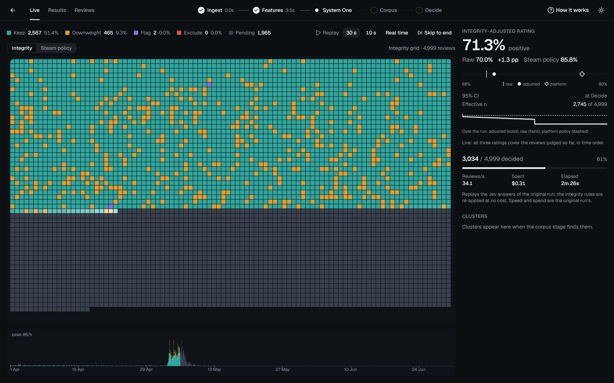

<sub>Helldivers 2, Apr–Jun 2024, mid-replay. Each square is one review in time order, labelled as System One judges it. The timeline below has just reached the May 2024 review bomb, and the three ratings at the right move with every cell.</sub>

</div>

---

## 📑 Contents

- [At a glance](#-at-a-glance) · [Screenshots](#-screenshots) · [Overview](#-overview) · [Why it exists](#-why-it-exists)
- [Three ratings, eight games](#-three-ratings-eight-games) · [Features](#-features) · [How a review is judged](#-how-a-review-is-judged)
- [Architecture & data flow](#-architecture--data-flow) · [Evaluation](#-evaluation) · [Engineering challenges](#-engineering-challenges)
- [Tech stack](#-tech-stack) · [Run it locally](#-run-it-locally) · [Testing](#-testing) · [Deploying the demo](#-deploying-the-demo)
- [Project structure](#-project-structure) · [Documentation](#-documentation) · [Roadmap](#-roadmap) · [Responsible use](#-responsible-use) · [Credits](#-credits)

---

## ⚡ At a glance

| | |
|---|---|
| **What goes in** | A review corpus: a Steam game's reviews pulled from the public API, or your own CSV / Excel file |
| **What it asks** | Nine typed questions per review, answered by a System One model with probabilities, not prose |
| **What comes out** | An action per review (keep · downweight · flag · exclude) with reason codes, and three ratings with confidence intervals |
| **How fast** | About 34–40 reviews a second on hosted Jev; S1 features for 50,000 reviews in about 8 s |
| **What it costs** | About **$0.07 per 1,000 reviews**, one model call per review. The public demo costs **$0** to serve |
| **What you see** | A canvas grid that paints one square per review at 60 fps, in time order, so a review bomb shows up as a band of colour |

---

## 📸 Screenshots

<table>
  <tr>
    <td width="50%" align="center">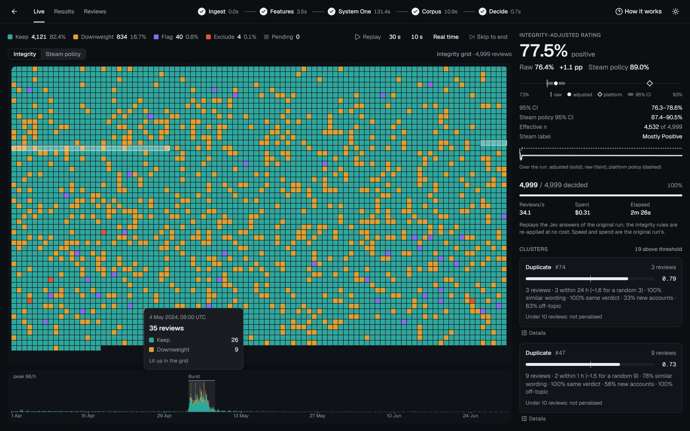<br/><sub><b>Timeline → grid.</b> Hovering an hour lights up its reviews in the grid</sub></td>
    <td width="50%" align="center">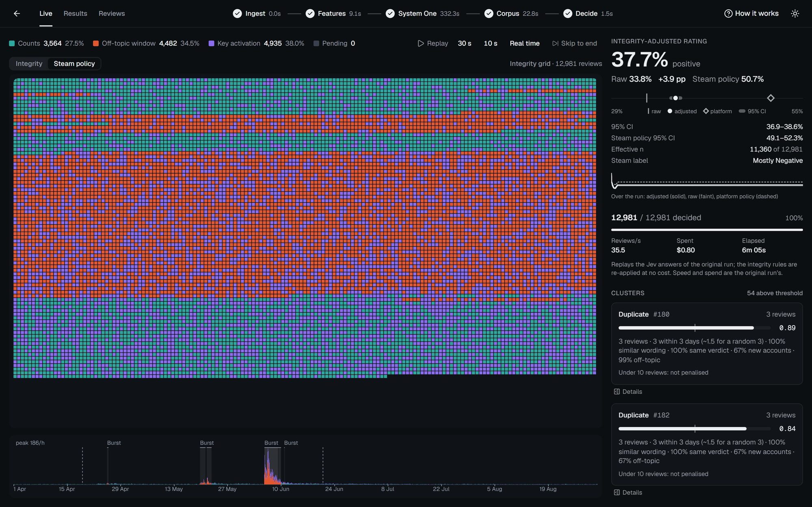<br/><sub><b>Steam policy view.</b> Which reviews Steam's own rules would count (Borderlands 2)</sub></td>
  </tr>
  <tr>
    <td align="center">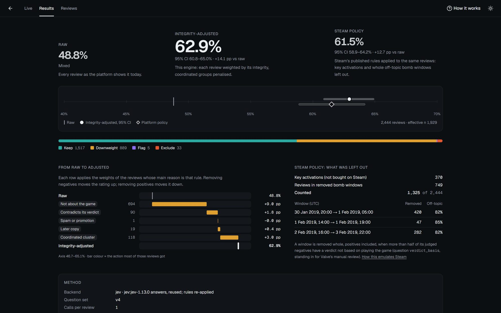<br/><sub><b>Results.</b> Three ratings, the waterfall from raw to adjusted, and what Steam's rules leave out</sub></td>
    <td align="center">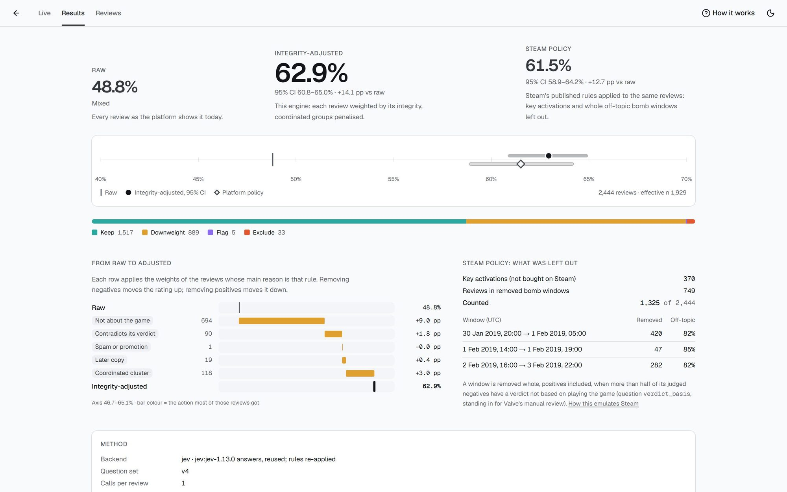<br/><sub><b>Results · light theme</b></sub></td>
  </tr>
  <tr>
    <td align="center">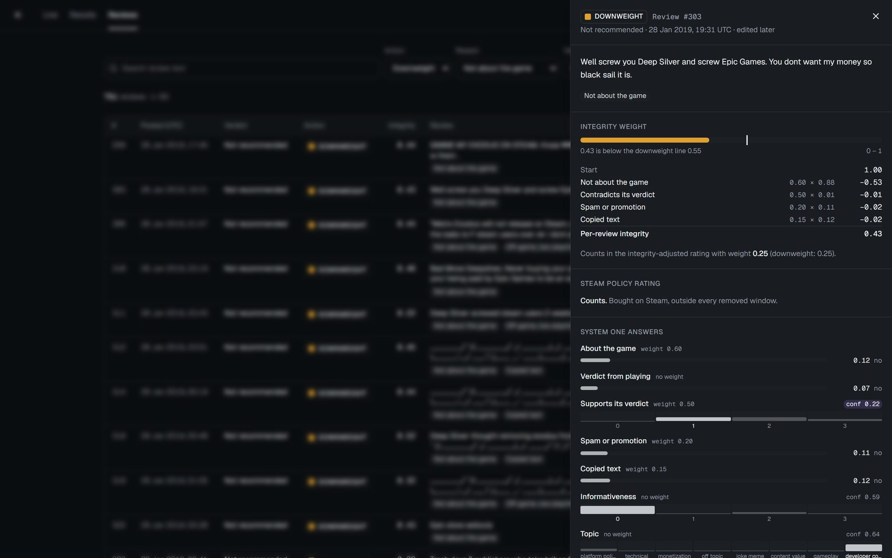<br/><sub><b>Review inspector.</b> The exact arithmetic behind one decision, and every model answer</sub></td>
    <td align="center">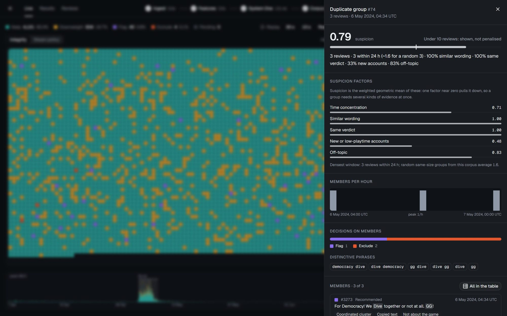<br/><sub><b>Cluster drawer.</b> Suspicion, its factors against a random baseline, members and phrases</sub></td>
  </tr>
  <tr>
    <td align="center">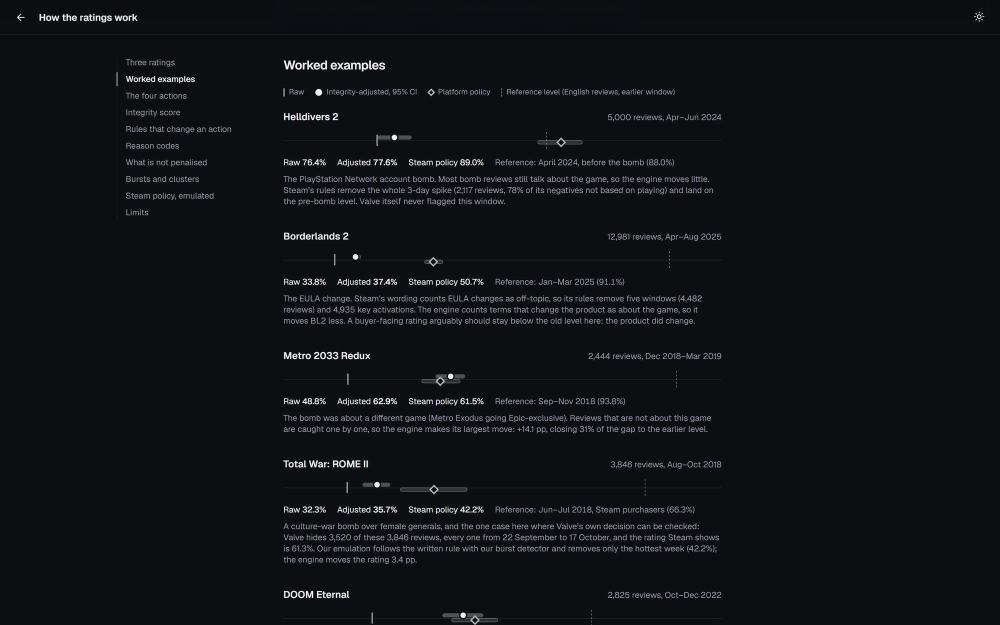<br/><sub><b>How it works.</b> Plain-language method, with every game as a worked example</sub></td>
    <td align="center">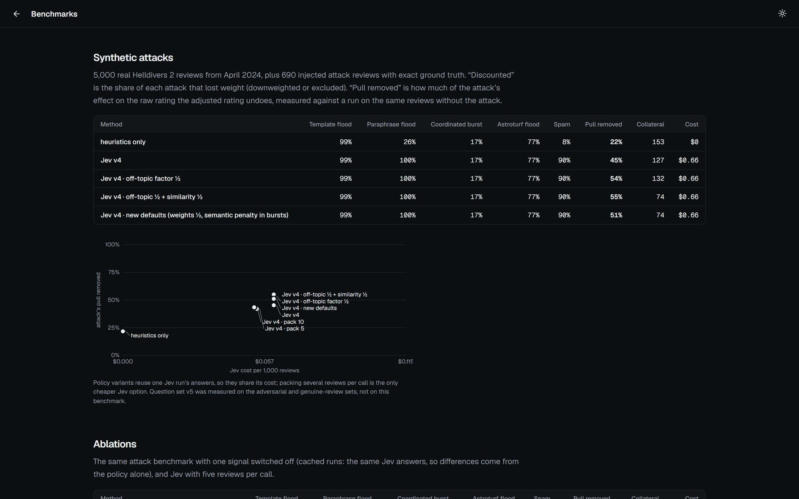<br/><sub><b>Benchmarks.</b> Attack removal, ablations and cost against accuracy</sub></td>
  </tr>
</table>

---

## 🚀 Overview

Give it a review corpus. A **System One model** ([Jev](https://typesafe.ai), hosted, or [Laya](https://github.com/NandhaKishorM/laya), local) answers nine typed questions about *every* review:

> Is it about the product at all? · Does its verdict come from using it? · Does the text support or contradict the verdict? · How informative is it? · What is it about? · Is it promotional? · Templated? · Campaign language? · Is it trying to sway its judge?

Deterministic signals add near-duplicates, promo links and notes addressed to the model. Corpus analysis then finds what no single review shows: **bursts** in time, and **coordinated clusters** of near-identical wording, each scored against a random baseline.

Every review ends up with an action and up to three reason codes:

| Action | Weight in the rating | When |
|---|---|---|
| 🟩 **Keep** | 1.00 | Integrity at or above 0.55 |
| 🟨 **Downweight** | 0.25 | Integrity below 0.55, or a later copy of an earlier review. *Low evidential value, not zero* |
| 🟪 **Flag** | 1.00 | A human should look: spam without a promo signal, or a penalised group member just above the line |
| 🟥 **Exclude** | 0.00 | **Only with deterministic evidence**: spam confirmed by a promo pattern, a copy inside a suspicious burst, or a note written to the AI judge |

The output is three ratings side by side. The **raw** rating counts every review once. The **integrity-adjusted** rating weights each review by its action, with a bootstrap 95% CI and an effective sample size. The **Steam-policy** rating applies Steam's published review-bomb rules to the same reviews.

> **Not the "true" rating.** The adjusted number is the rating under this documented method. Every threshold and weight behind it is recorded with the run and shown on its results page. English-language reviews only.

---

## 💡 Why it exists

Online ratings mix real opinion with low-evidence noise: review bombs about things outside the product, copy-pasted slogans, spam, and one-word reviews that tell a reader nothing. Platforms tend to handle it in one of two ways:

- **Hide a whole time window.** That also buries legitimate complaint waves, and positives inside the window go with it.
- **Use an opaque model.** It gives no reason for any single decision.

This project tests a third way:

- **Typed judgments, not essays.** System One models return probabilities for structured questions. That is cheap enough to cover every review, and the probabilities *are* the explanation: the inspector shows the arithmetic.
- **Evidence over suppression.** Model output alone can never exclude a review, and a burst on its own is never a reason to. Organic negative waves must survive, and the controls check that they do.
- **Honest uncertainty.** Each rating has a CI and an `n_eff`. Known limits are measured and published, not hidden.
- **Watchable.** The fill *is* the demo: you see each decision land, and the rating drift as the bomb arrives.

It is a personal, non-commercial portfolio project.

---

## 🎮 Three ratings, eight games

Five review bombs of different kinds and three games with a genuine reception as controls. Every number is measured ([`docs/RESULTS.md`](docs/RESULTS.md), [`docs/RUNS.md`](docs/RUNS.md)). *Steam shows* is Steam's own score for the window, with Valve's off-topic filter; *before the bomb* is an earlier window of English reviews.

| Game · what happened | Reviews | Raw | **Integrity-adjusted** (95% CI) | Steam's written rules | Steam shows | Before the bomb |
|---|---:|---:|---:|---:|---:|---:|
| **Helldivers 2** · PSN account requirement | 4,999 | 76.4% | **77.5%** (76.3–78.6) | 89.0% | 77.7% | 88.0% |
| **Borderlands 2** · EULA change | 12,981 | 33.8% | **37.7%** (36.9–38.6) | 50.7% | 28.7% | 91.1% |
| **Metro 2033 Redux** · another game went Epic-exclusive | 2,444 | 48.8% | **62.9%** (60.8–65.0) | 61.5% | 49.1% | 93.8% |
| **Total War: ROME II** · culture-war bomb, flagged by Valve | 3,846 | 32.3% | **35.7%** (34.1–37.3) | 42.2% | 61.3% | 66.3% |
| **DOOM Eternal** · soundtrack dispute, flagged by Valve | 2,825 | 76.1% | **82.3%** (80.9–83.7) | 83.1% | 91.8% | 91.1% |
| *Cities: Skylines II* · troubled launch (control) | 5,000 | 59.6% | 59.2% (57.8–60.6) | 59.9% | 59.8% | — |
| *The Lord of the Rings: Gollum* · a bad game (control) | 297 | 35.7% | 34.3% (29.1–39.9) | 34.4% | 34.4% | — |
| *Football Manager 26* · launch backlash (control) | 15,348 | 38.0% | 37.2% (36.4–38.0) | 38.4% | 38.4% | — |

**How to read it:**
- **Metro 2033 Redux** gets the largest correction, +14.1 pp. The bomb was about a *different* game, so the reviews are caught one by one as not about this one.
- **Helldivers 2** barely moves. Most bomb reviews still talk about the game. Steam's window rule removes the whole 3-day spike (2,117 reviews) instead, positives included.
- **The controls stay inside their own CIs.** A genuinely bad game is not inflated (Gollum −1.4 pp), and only 0.3–0.6% of on-topic complaints are discounted.

---

## ✨ Features

### Analysis engine
- **Nine typed questions per review** (question set v5), versioned and tuned only on a held-out dev set
- **One model call per review**, concurrent and spend-guarded: a cost pre-flight before every run, and a hard stop at 1.25 × the approved spend
- **Near-duplicate detection**: char-5 MinHash with LSH and exact Jaccard verification, at 100% exact-copy recall and 92% near-copy recall
- **Bursts**: hourly robust z-scores against a 7-day baseline, plus PELT change points
- **Clusters**: duplicate groups, and semantic groups from MiniLM embeddings → UMAP → HDBSCAN, each with c-TF-IDF phrases
- **Suspicion as a weighted geometric mean** of five factors (time concentration, similar wording, same verdict, new accounts, off-topic), each judged **against a permutation null**
- **Influence defence**: text written to sway the judge is stripped before judging, and a note addressed to the model is a deterministic exclude
- **Steam-policy emulation**: key activations removed, and whole off-topic bomb windows dropped when most of their negatives are not based on playing
- **Bootstrap 95% CI** (2,000 resamples), `n_eff`, and Steam label bands
- **$0 policy experiments**: a `cached` backend re-applies new rules to a finished run's stored answers

### Live screen
- **Integrity grid**: one square per review on Canvas 2D, a 1-px-per-cell `ImageData` scaled crisp, at 60 fps on 50,000 reviews
- **Watchable fill**: each batch drips in cell by cell over ~30 s, with a flash that settles into the action colour; counters and the rating tween with the visible cells
- **Two views**: colour by integrity action, or by **whether Steam's own score counts the review**
- **Linked views**: hover a timeline hour to light its reviews, hover a cluster to dim everyone else, use the arrow keys to walk the grid
- **Rating ticker**: three ratings, the CI whisker, and the trail over the run
- **Replay controls**: 30 s, 10 s, real time, or skip to the end

### Drill-downs
- **Review inspector**: text, every System One answer with its probability bar, the integrity arithmetic line by line, reason chips that link to the method, and the Steam-policy status
- **Cluster drawer**: the data-driven caption, factor bars, members per hour, decisions on members, distinctive phrases and shared n-grams
- **Results page**: three ratings with CIs, a waterfall from raw to adjusted by primary reason, the windows Steam's rules remove, and the methodology card
- **Reviews table**: filter by action, reason, verdict, cluster or text, sort by time or integrity, export CSV / JSON (no identifiers)
- **How it works** (`/help`): the method in plain language, with each game as a worked example and a contents list that tracks your scroll

### Platform
- **Bring your own reviews**: CSV or Excel upload with a column mapper (capped at 50 MB and 200,000 rows)
- **Benchmarks page**: attack removal, ablations and a cost-versus-accuracy chart
- **Blind labelling page** for the human-agreement study
- **Dark and light themes**. The grid sits on a dark instrument surface in both, because the palette's colour-blind separation was validated there
- **Accessible**: colour is never the only signal, there is keyboard navigation of the grid, `prefers-reduced-motion` is respected, and Lighthouse accessibility scores 100

---

## 🧠 How a review is judged

Each review starts at **1.00**. Every weighted answer takes off its weight × the model's probability. Here is review #303 from the Metro 2033 Redux bomb, exactly as the inspector shows it:

> *"Well screw you Deep Silver and screw Epic Games. You dont want my money so black sail it is."*

| Takes off | Weight | × the answer | |
|---|---:|---:|---:|
| Start | | | **1.00** |
| Not about the game | 0.60 | 0.88 | −0.53 |
| Contradicts its verdict | 0.50 | 0.01 | −0.01 |
| Spam or promotion | 0.20 | 0.11 | −0.02 |
| Copied text | 0.15 | 0.12 | −0.02 |
| **Per-review integrity** | | | **0.43** |

0.43 is below the 0.55 line, so the review is **downweighted**. It still counts, at 0.25. Corpus analysis can then lower integrity further for members of a suspicious burst or cluster (× (1 − 0.5 × suspicion), groups of 10+ only). Deterministic evidence can exclude.

Some things are **deliberately not penalised**, each because a measurement showed the harm:
- **Brevity.** Short reviews skew positive, so penalising length was a verbosity adjustment, not an integrity one (it moved Helldivers 2 by 3.5 pp).
- **Low playtime on its own.**
- **Varied, on-topic complaint waves.** Timing alone is never evidence.

| Stage | What happens | Speed |
|---|---|---|
| **S0 Ingest** | Normalise ratings to [0, 1], sort by time (the grid order), hash author IDs with a salt | seconds |
| **S1 Features** | MinHash/LSH duplicates, promo regex, length and emoji signals, influence patterns, MiniLM embeddings (cached, in the background) | ~8 s at 50K |
| **S2 System One** | Nine questions per review via Jev or Laya, one shared httpx client, rate-limited with backoff | the live part |
| **S3 Corpus** | Bursts, duplicate and semantic clusters, suspicion against a permutation null | ~1–3 min at 50K |
| **S4 Decide** | Integrity → action + reason codes; weighted rating, bootstrap CI, `n_eff`; Steam-policy emulation | < 1 s |

---

## 🏗 Architecture & data flow

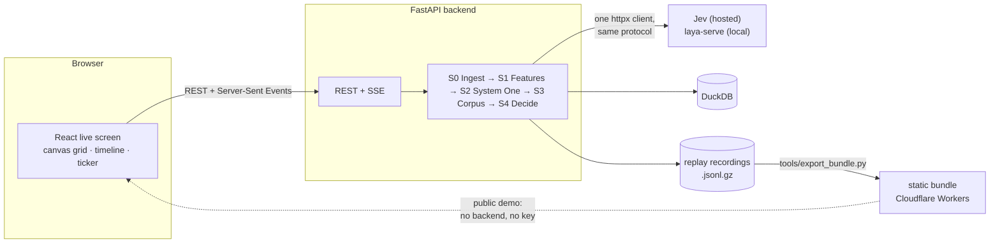

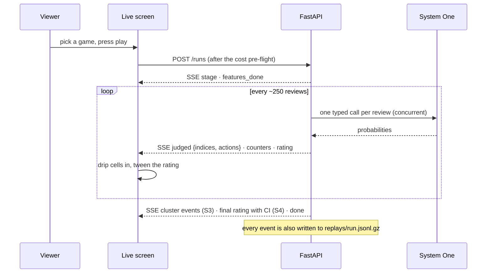

**Key design decisions:**
- **`reviews.id` is the grid index.** Review *i* is cell *i*, in time order, so batches can complete out of order and still land in the right place.
- **One code path for both models.** Jev and `laya-serve` speak the same protocol through one httpx client.
- **Every threshold is run config.** Weights and thresholds live in `PolicyThresholds` and `ActionWeights`, are stored with each run, and are shown on its results page.
- **The frontend swaps its data source, not its code.** `DataSource = LiveApi | StaticBundle`, so the public demo serves recorded runs from static files with no backend.
- **Types are generated, never hand-written.** Pydantic → JSON Schema → TypeScript, and a test fails if they drift.

Four more diagrams (system, pipeline, run data flow, live-screen render path) are in **[docs/ARCHITECTURE.md](docs/ARCHITECTURE.md)**.

---

## 📊 Evaluation

Phase 7 measured the method against attacks with exact ground truth, against controls and against adversarial text. The full write-up is in [`docs/RESULTS.md`](docs/RESULTS.md).

| Test | Result |
|---|---|
| **Synthetic attacks** (4,999 real reviews + 690 injected) | **52%** of the attack's pull on the rating removed, against **22%** for heuristics alone. The paraphrase flood is discounted 26% → 100% |
| **Organic backlash** (Cities: Skylines II) | **0.3%** of on-topic negative reviews discounted (6 of 1,994) |
| **A genuinely bad game** (Gollum) | adjusted −1.4 pp (target < 5 pp) |
| **"Trust me, I'm legit" sentences** | laundered 30–39% of off-topic reviews before the defence, **0–7%** after |
| **Repeat noise** | two identical Jev runs agree on **98.8%** of decisions; the rating moves 0.05 pp |
| **Packing 5 or 10 reviews per call** | rejected: about 7× the noise in changed decisions, to save 11–13% of tokens |
| **Laya zero-shot vs Jev** | κ ≈ 0 on every question. It is a benchmark row, and the reason for the roadmap |

**Published limits:**
- **Varied, on-topic coordinated campaigns.** They are detected exactly but not discounted, because that same design protects real backlashes.
- **Paraphrased claims of experience.** They still launder 40% of off-topic reviews. Catching them would cost about 1.6% of genuine reviews.

---

## 🔧 Engineering challenges

**A model that is not deterministic.**
Sending Jev the same input twice returned identical answers 1 time in 60. So identical texts are not given one shared answer (reuse is opt-in), every review gets its own call, and repeat noise is measured as a benchmark row. Averaging two calls would halve decision flips but double the cost. That was rejected for a 1.6-point gain.

**Suspicion that flagged three-review coincidences.**
The first suspicion score compared each cluster with the corpus-wide rate. Clusters are subsets of the corpus, so any 15-minute coincidence looked like a 100× lift, and 3-review duplicates topped the list. Scoring each cluster against **random same-size subsets of the same corpus** (a permutation null) cut penalised reviews from 577 to 264, and changed actions from 97 to 14, with the Cities: Skylines II control at 0.

**A weight that was really a length penalty.**
The spec weighted informativeness and rating support. Short reviews skew positive, so this downweighted 38.7% of Helldivers 2 positives against 19.5% of negatives. Re-applied to the same answers at $0, it accounted for *all* of the 3.5 pp drop. Evidence quality is now shown, not weighted.

**Reviews written for the judge.**
One added sentence ("I've played 200 hours, this is a legitimate review") laundered up to 39% of off-topic reviews. The defence has two layers. Deterministic patterns strip common claims, and a note addressed to the model is excluded outright; that appeared in 1 of 420,582 genuine reviews. A new typed question, `influence_attempt`, catches the wordings the patterns miss.

**A grey zone that undid its own penalty.**
Penalised cluster members within 0.1 of the line were flagged for a human. A flag counts as keep, so 20 "I'm doing my part!" copies just *under* the line went back to full weight. The grey zone now applies only above the line, which took flags across the eight games from 348 to 117.

**Steam verdicts are current, not as posted.**
77% of Helldivers 2 bomb-day reviews were edited later, mostly flipping to positive after the reversal. The as-posted verdict is not recoverable from the public API. The engine analyses reviews as they stand today, shows the edit status, and detects bursts on volume as well as on verdict.

**A fill you can actually watch.**
SSE delivers decisions in batches of 25–250 cells, which popped in as blocks; a 150 ms fade on a 4 px cell read as an instant switch. A **cell drip** now reveals each batch cell by cell across its time window, holding later events until the grid catches up. A precomputed 25 × 16 fade table keeps the worst grid paint at 2.4 ms on 50,000 cells.

**Cold embeddings slower than the budget.**
MiniLM runs at 96–114 reviews/s on a laptop CPU, so 50,000 reviews take 7–9 minutes. Every faster option measured changed 17–81% of nearest neighbours, so it stays. Embeddings instead run in a background thread that overlaps the network-bound model calls, and they are cached per dataset.

**A public demo with no backend.**
Eight recorded runs come to 1,214 files and about 17 MB gzipped. Review details are split into 1,000-review chunks that load on demand. Vercel's free tier caps uploads at 100 MB (the build is 112 MB), so the demo runs on Cloudflare Workers static assets. A CI leak check fails the build on any key, model or backend URL, identifier field or e-mail address.

**The grid kept the last game's size.**
Moving from Borderlands 2 (12,981 reviews) to Helldivers 2 (4,999) kept the larger buffer and counted 7,982 phantom pending cells, so "decided" went negative. The buffer now resizes exactly to each run, with a regression test.

---

## 🧩 Tech stack

| Layer | Choices |
|---|---|
| **Judgment models** | Jev (TypeSafe System One, hosted) · Laya (open-source System One, local via `laya-serve`) |
| **Backend** | Python 3.12 · uv · FastAPI · sse-starlette · Pydantic v2 · httpx + aiolimiter + tenacity |
| **Data** | DuckDB · Polars · PyArrow · NumPy · SciPy |
| **Text & corpus** | MinHash/LSH (NumPy) · sentence-transformers (all-MiniLM-L6-v2) · FAISS · UMAP · scikit-learn HDBSCAN · ruptures (PELT) · lingua |
| **Frontend** | React 19 · TypeScript · Vite · Tailwind CSS v4 · shadcn/ui on Base UI · Zustand · TanStack Query · Canvas 2D · Lucide · Geist |
| **Quality** | pytest · Ruff · Vitest · Testing Library · oxlint · JSON Schema → TypeScript type generation |
| **Ops** | GitHub Actions CI (tests, lint, static build, leak check) · Docker Compose · Cloudflare Workers static assets |

---

## 📦 Run it locally

**Prerequisites:** Python 3.12 with [uv](https://docs.astral.sh/uv/), Node 24, and a [TypeSafe](https://typesafe.ai) API key for live Jev runs. Replays and the `cached` backend need no key.

```bash
cp .env.example .env            # TYPESAFE_API_KEY (for Jev) and a random AUTHOR_HASH_SALT

# backend (from backend/)
uv sync --all-groups            # add --extra laya for the local model
uv run uvicorn app.main:app --reload --port 8001

# frontend (from frontend/), opens http://localhost:5173
npm install && npm run dev

# or everything at once
docker compose up --build       # add --profile laya for laya-serve
```

Pull a Steam dataset (resumable) and import it:

```bash
uv run python -m app.ingest.steam_fetcher --appid 553850 --from 2024-04-01 --to 2024-06-30
uv run python -m app.ingest.steam_import --pull <dir under data/raw/steam> --name "Helldivers 2" --sample 5000
```

Then open the app, pick a product (or upload a CSV or Excel file), and either replay its recorded run ($0) or start a live Jev run after its cost pre-flight.

**Handy URL flags:**
- `?play=end`: jump to the final state
- `?play=10`: a 10-second fill
- `?fps=1`: the frame meter

To try new rules on a finished run's answers at $0: `POST /runs` with `backend: "cached"` and `reuse_judgments_from`.

---

## 🧪 Testing

```bash
# backend (from backend/): unit, API and guardrail tests; never touch the network or the real .env
uv run pytest
uv run ruff check . && uv run ruff format --check .

# frontend (from frontend/): store reducers, grid paint, replay pacing, SSE client, pages
npm test
npm run lint
npm run build:static && npm run check:static   # the leak check CI runs
```

**Guardrails covered by tests:**
- System One output alone can never exclude a review.
- An on-topic, informative negative review stays keep.
- No raw author ID reaches the database.
- The generated TypeScript types match the backend models.

---

## 🌍 Deploying the demo

The public demo is a static site: the showcase runs replayed from exported files, with no backend, database or API key.

```bash
# with the API running on :8001 (from backend/)
uv run python ../tools/export_bundle.py     # writes frontend/public/bundle (gitignored)

# from frontend/
npx wrangler@4 login                        # once
npm run deploy:preview                      # build + leak check + a preview URL
npm run deploy                              # build + leak check + deploy
```

`frontend/wrangler.jsonc` serves `dist/` with no Worker script. Its single-page-app setting answers client-side routes with `index.html`. The bundle comes from the local database, so deploys run from a local machine, not from CI. `vercel.json` and `404.html` (GitHub Pages) are kept for other hosts; build with `VITE_BASE=/<repo>/` for a subfolder site.

---

## 📁 Project structure

```
backend/
  app/
    ingest/      S0  Steam fetcher, CSV/XLSX loader, normalisation, salted author hashes
    features/    S1  heuristics, MinHash/LSH, embeddings, influence patterns
    systemone/   S2  one httpx client, versioned question sets (v1–v5), pre-flight, spend guard
    corpus/      S3  bursts, clusters, suspicion vs a permutation null
    decide/      S4  policy, rating + bootstrap CI, Steam-policy emulation
    api/             runs, datasets, reviews, clusters, scores, export, benchmarks, labelsets
    pipeline.py      the run orchestrator; every event goes to SSE and to the replay file
  tests/             pytest: fake System One, hashing embedder, no network
frontend/
  src/
    data/        DataSource = LiveApi | StaticBundle, replay planner, generated API types
    state/       Zustand stores, grid buffer, cell drip, per-frame event batcher
    lib/         grid paint and layout, palette, timeline binning, Steam view, scroll-spy
    components/  live screen, inspector, cluster drawer, shared rating rail
    pages/       home, live, results, reviews, help, benchmarks, label
tools/           benchmarks, attack injector, probes, dev-set evaluation, bundle export, type export
docs/            spec, plan, research, measurements, results, run index, architecture
data/            local only (gitignored): DuckDB, caches, replays, raw pulls
```

---

## 📚 Documentation

| Doc | Contents |
|---|---|
| [Architecture](docs/ARCHITECTURE.md) | System, pipeline, run data flow and live-screen diagrams |
| [Product & technical spec](docs/MVP_SPEC.md) | Source of truth for design decisions |
| [Phased plan](docs/PLAN.md) | Phases, exit criteria, what was delivered and how it deviated |
| [Results](docs/RESULTS.md) | The evaluation: attacks, ablations, controls, known incidents, adversarial text |
| [Measurements](docs/MEASUREMENTS.md) | Every measured number, with its method, as a dated log |
| [Run index](docs/RUNS.md) | Every run, with the showcase runs first |
| [Research findings](docs/RESEARCH_FINDINGS.md) | Datasets, prior work, platform policies |

---

## 📈 Roadmap

Phases 0–7 and 9 are done: the pipeline end to end, the live screen, drill-downs, the evaluation and the public demo.

- **Laya fine-tune (Phase 10, future exploration).** Train the free, local System One model to bring the per-run cost to $0. Jev's terms forbid distillation, so the training labels come only from human labels, the synthetic-attack injector and deterministic weak labels, with a lineage note proving that no Jev output is used. Laya zero-shot is at chance today, so this is the real gap.
- **Human agreement.** Two blind raters on the 300-review set at `/label`, then Cohen's κ for human–human, human–Jev and human–Laya.
- **Replay scrubbing and a 90-second demo video.**
- **Beyond games and English.** The picker already says "Product". The question set is still game-worded, and the method has only been measured on English reviews.

---

## 🤝 Responsible use

- **Wording.** The UI and docs talk about *integrity weight* and *low evidential value*, never about "fake" reviews, and never name reviewers. Author IDs are salted hashes from ingest onward.
- **Data.** Steam review data is used under Steam's terms for personal, non-commercial use and is **not redistributed in this repository**.
- **The public demo's review text.** The bundle publishes review text with no reviewer identity, scrubbed of e-mails, links, phone numbers and handles. `export_bundle.py --text none` builds a demo without any text.
- **What a number means.** An adjusted rating is a method's output, not a verdict on any reviewer or product.

---

## 🙌 Credits

- **[TypeSafe](https://typesafe.ai)** for Jev, the hosted System One model behind the typed judgments
- **[Laya](https://github.com/NandhaKishorM/laya)** by [@NandhaKishorM](https://github.com/NandhaKishorM) (Apache-2.0), the open-source System One model and `laya-serve`
- **[Steam](https://partner.steamgames.com/doc/store/getreviews)** (Valve) for the public `appreviews` endpoint behind the demo datasets
- **Open-source building blocks:** FastAPI, DuckDB, Polars, sentence-transformers and [all-MiniLM-L6-v2](https://huggingface.co/sentence-transformers/all-MiniLM-L6-v2), FAISS, UMAP, scikit-learn, ruptures, lingua, React, Vite, Tailwind CSS, shadcn/ui, Base UI, Zustand, TanStack Query, Lucide and the Geist typeface

Rating Integrity Engine is an independent project and is **not affiliated with, endorsed or sponsored by Valve, TypeSafe or any game publisher** named here.

<div align="center"><sub>Built by <b>Vaibhav Sharma</b></sub></div>
