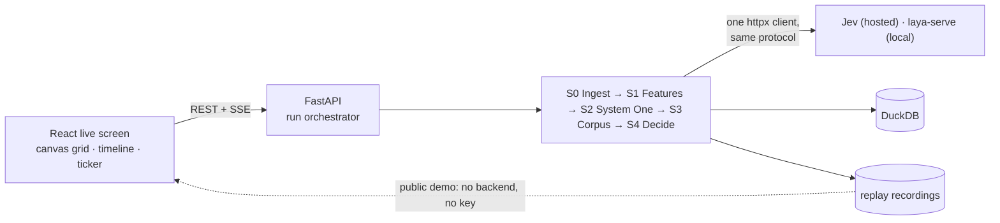

<p align="center">
  <picture>
    <source media="(prefers-color-scheme: dark)" srcset="docs/assets/banner-dark.svg">
    
  </picture>
</p>

<p align="center">
  Fast, typed AI judgments on every review, corpus analysis for bursts and coordinated clusters,<br>
  and an <b>integrity-adjusted rating with a confidence interval</b> under a documented, auditable method.
</p>

<p align="center">
  <a href="#overview">Overview</a> ·
  <a href="#why-it-exists">Why</a> ·
  <a href="#how-it-works">How it works</a> ·
  <a href="#architecture">Architecture</a> ·
  <a href="#tech-stack">Tech stack</a> ·
  <a href="#results-so-far">Results</a> ·
  <a href="#run-it-locally">Run it</a> ·
  <a href="#credits">Credits</a>
</p>

<p align="center">
  
  <br><sub>A finished Jev run on 5,000 Helldivers 2 reviews (Apr–Jun 2024). The shaded burst is the May 2024 review bomb. This run predates the current policy defaults, hence 72.5% rather than the 72.9% below.</sub>
</p>

---

## Overview

Give it a review corpus (a Steam game's reviews, or a CSV of your own). A **System One model** answers six typed questions about every review, at speed: how informative it is, whether the text supports its verdict, what it is about, and whether it is promotional, templated or campaign language. Deterministic signals add near-duplicates and promo links. Corpus analysis then finds what no single review shows: **bursts** in time and **coordinated clusters** of near-identical wording.

Each review gets an action (**keep**, **downweight**, **flag** for a human, or **exclude**) with its top three reason codes. The output is the raw rating next to the **integrity-adjusted rating**, with a bootstrap 95% CI, an effective sample size and a methodology card.

Watching it run is part of the product. Thousands of squares fill in live, one per review in time order, so a review bomb shows up as a solid band of colour.

> **Not the "true" rating.** The adjusted number is the rating under this documented method, and every threshold and weight behind it is visible and adjustable. English-language reviews only.

## Why it exists

Online ratings mix real opinion with low-evidence noise: review bombs about things outside the product, copy-pasted slogans, spam, and one-word reviews that tell a reader nothing. Platforms usually handle this either by hiding everything in a time window, which also buries legitimate complaint waves, or with opaque models that give no reason for a decision.

This project tests a third approach:

- **Typed judgments, not essays.** System One models return calibrated probabilities for structured questions. That is fast and cheap enough to cover *every* review (about $0.25 per 5,000 reviews on Jev), and the probabilities themselves are the explanation.
- **Evidence over suppression.** Organic negative waves must survive. Only deterministic evidence can exclude a review. A burst on its own is never a reason to exclude.
- **Honest uncertainty.** A rating comes with a CI and `n_eff`, and controls check that the method neither inflates a genuinely bad game nor suppresses a real backlash.

It is a portfolio project: a public, replay-only demo that judges 50K Steam reviews visibly, finds the Helldivers 2 review bomb (May 2024), and compares hosted Jev with local Laya on cost, latency and accuracy.

## How it works

| Stage | What happens | Speed |
|---|---|---|
| **S0 Ingest** | Normalise ratings to [0, 1], sort by time (the grid order), hash author IDs with a salt | seconds |
| **S1 Features** | MinHash/LSH near-duplicates, promo-link regex, length and emoji signals, MiniLM sentence embeddings | seconds |
| **S2 System One** | Six typed questions per review via [Jev](https://typesafe.ai) or [Laya](https://github.com/NandhaKishorM/laya); concurrent and spend-guarded | the live part |
| **S3 Corpus** | Bursts (robust z-score vs a 7-day baseline, PELT change points), duplicate clusters, semantic clusters (UMAP → HDBSCAN), suspicion scored against a permutation null | ~1–3 min at 50K |
| **S4 Decide** | Integrity score → action plus reason codes; weighted rating, bootstrap CI, `n_eff`, Steam label bands | < 1 s |

The question set is versioned (`backend/app/systemone/questions_v*.py`) and tuned only on a held-out dev set.

## Architecture



Every run's event stream is recorded, so the public demo replays real runs with no backend and no API key. The full diagrams, covering system, pipeline, run data flow and the live-screen render path, are in **[docs/ARCHITECTURE.md](docs/ARCHITECTURE.md)**.

## Tech stack

| Layer | Choices |
|---|---|
| **Judgment models** | Jev (TypeSafe System One, hosted), Laya (open-source System One, local via `laya-serve`) |
| **Backend** | Python 3.12 · uv · FastAPI · sse-starlette · Pydantic v2 · httpx + aiolimiter + tenacity |
| **Data** | DuckDB · Polars · PyArrow · NumPy · SciPy |
| **Text & corpus** | datasketch (MinHash/LSH) · sentence-transformers (all-MiniLM-L6-v2) · FAISS · UMAP · scikit-learn HDBSCAN · ruptures (PELT) · lingua |
| **Frontend** | React 19 · TypeScript · Vite · Tailwind CSS v4 · shadcn/ui on Base UI · Zustand · TanStack Query · Canvas 2D |
| **Quality** | pytest · Ruff · Vitest · Testing Library · oxlint · types generated from the backend models (JSON Schema → TS) |
| **Ops** | Docker Compose · Kaggle/Colab T4 for GPU work (CPU-only otherwise) |

## Results so far

All numbers were measured; see [`docs/RESULTS.md`](docs/RESULTS.md) and [`docs/MEASUREMENTS.md`](docs/MEASUREMENTS.md). Three ratings per game: raw, the engine's integrity-adjusted rating, and Steam's written review-bomb rules applied to the same reviews. "Steam shows" is Steam's own score for the window, with Valve's off-topic filter.

| Game (window) | Raw | Integrity-adjusted | Steam rules | Steam shows | Before the bomb |
|---|---|---|---|---|---|
| Helldivers 2 (Apr–Jun 2024, account requirement) | 76.4% | 77.5% | 89.0% | 77.7% | 88.0% |
| Borderlands 2 (Apr–Aug 2025, EULA) | 33.8% | 37.7% | 50.7% | 28.7% | 91.1% |
| Metro 2033 Redux (Dec 2018–Mar 2019, another game) | 48.8% | 62.9% | 61.5% | 49.1% | 93.8% |
| Total War: ROME II (Aug–Oct 2018, culture war) | 32.3% | 35.7% | 42.2% | 61.3% | 66.3% |
| DOOM Eternal (Oct–Dec 2022, soundtrack dispute) | 76.1% | **82.3%** | 83.1% | 91.8% | 91.1% |
| Cities: Skylines II · Gollum · FM26 (genuine reception) | 59.6 · 35.7 · 38.0% | 59.2 · 34.3 · 37.2% | 59.9 · 34.4 · 38.4% | 59.8 · 34.4 · 38.4% | — |

- **Attack benchmark** (4,999 real reviews + 690 injected, exact ground truth): the engine removes 51% of the attack's pull on the rating, against 22% for heuristics alone. Genuine on-topic complaints are discounted 0.3–0.6% of the time.
- **Adversarial text:** one sentence claiming legitimacy laundered 29–53% of off-topic reviews before the defence; 0–7% after it.
- **Cost:** about $0.07 of Jev per 1,000 reviews, one call per review. The public demo replays recorded runs and costs nothing to serve.

## Run it locally

```bash
cp .env.example .env            # TYPESAFE_API_KEY (for Jev) and a random AUTHOR_HASH_SALT

# backend (from backend/)
uv sync --all-groups            # add --extra laya for the local model
uv run uvicorn app.main:app --reload --port 8001

# frontend (from frontend/), opens http://localhost:5173
npm install && npm run dev

# or everything at once
docker compose up --build       # add --profile laya for laya-serve
```

Pull a Steam dataset (resumable) and import it:

```bash
uv run python -m app.ingest.steam_fetcher --appid 553850 --from 2024-04-01 --to 2024-06-30
uv run python -m app.ingest.steam_import --pull <dir under data/raw/steam> --name "Helldivers 2" --sample 5000
```

Then open the app and start a $0 heuristic run, or a Jev run after its cost pre-flight. Finished runs replay automatically; add `?play=end` to see the final state, or `?fps=1` for the frame meter.

**Tests:** `uv run pytest` (backend) · `npm test` (frontend). Tests never touch the network or the real `.env`.

## Repository layout

```
backend/    FastAPI app: ingest (S0) · features (S1) · systemone (S2) · corpus (S3) · decide (S4)
frontend/   React app: live grid, timeline, ticker, clusters; DataSource = LiveApi | StaticBundle
tools/      benchmarks, probes, dev-set evaluation, type export
notebooks/  Kaggle/Colab GPU work
docs/       spec, plan, research, measurements, architecture
data/       local only (gitignored): DuckDB, caches, replays, raw pulls
```

## Documentation

| Doc | Contents |
|---|---|
| [Architecture](docs/ARCHITECTURE.md) | System, pipeline, run data flow and live-screen diagrams |
| [Product & technical spec](docs/MVP_SPEC.md) | Source of truth for design decisions |
| [Phased plan](docs/PLAN.md) | Phases, exit criteria, what was delivered and how it deviated |
| [Measurements](docs/MEASUREMENTS.md) | Every measured number, with method |
| [Research findings](docs/RESEARCH_FINDINGS.md) | Datasets, prior work, platform policies |

## Status

Phases 0–7 are done: the pipeline end to end, the live screen, drill-downs and results, and the evaluation (see [RESULTS](docs/RESULTS.md)). Phase 9, the public replay-only demo, is in progress; human-agreement labels are being collected. See [the plan](docs/PLAN.md).

## Public demo (static)

The public demo is a static site: the showcase runs replayed from exported files, with no backend, database or API key.

```bash
# with the API running on :8001 (from backend/)
uv run python ../tools/export_bundle.py           # writes frontend/public/bundle (gitignored)
# from frontend/
npm run build:static && npm run check:static      # dist/ is the site; the check fails on any key or backend URL
```

- **Hosting: Cloudflare Workers static assets** (free: unlimited static requests and bandwidth, 20,000 files, 25 MiB per file). `frontend/wrangler.jsonc` serves `dist/` with no Worker script, and its single-page-app setting answers client-side routes with `index.html` and a 200.

  ```bash
  npx wrangler@4 login           # once, from frontend/
  npm run deploy:preview         # build + leak check + upload a version with a preview URL (not live)
  npm run deploy                 # build + leak check + deploy to rating-integrity-engine.<account>.workers.dev
  ```

  The bundle comes from the local database, so deploys run from a local machine, not from CI. Other hosts: `vercel.json` (Vercel) and `404.html` (GitHub Pages) are kept; `.assetsignore` keeps `404.html` out of the Workers upload. Netlify would need a `_redirects` file with `/* /index.html 200`, which Workers rejects as a redirect loop, so it is not shipped.
- **Subfolder sites:** for a GitHub Pages project site, build with `VITE_BASE=/<repo>/`.

## Responsible use

- The UI and docs talk about *integrity weight* and *low evidential value*, never about "fake" reviews, and never name reviewers. Author IDs are salted hashes from ingest onward.
- Steam review data is used under Steam's terms for personal, non-commercial use and is **not redistributed** in this repository. The public demo's bundle is exported locally and publishes review text without any reviewer identity, scrubbed of e-mails, links, phone numbers and handles (owner decision, 2026-10-08). `export_bundle.py --text none` builds a demo without text.
- An adjusted rating is a method's output, not a verdict on any reviewer or product.

## Credits

- **[TypeSafe](https://typesafe.ai)** for Jev, the hosted System One model used for the typed judgments.
- **[Laya](https://github.com/NandhaKishorM/laya)** by [@NandhaKishorM](https://github.com/NandhaKishorM) (Apache-2.0), the open-source System One model and `laya-serve`.
- **[Steam](https://partner.steamgames.com/doc/store/getreviews)** (Valve) for the public `appreviews` endpoint behind the demo datasets.
- **Open-source building blocks:** FastAPI, DuckDB, Polars, sentence-transformers and the [all-MiniLM-L6-v2](https://huggingface.co/sentence-transformers/all-MiniLM-L6-v2) model, UMAP, scikit-learn, ruptures, datasketch, FAISS, React, Vite, Tailwind CSS, shadcn/ui, Base UI, Zustand, TanStack Query, Lucide icons and the Geist typeface.

Built by **Vaibhav Sharma**.
