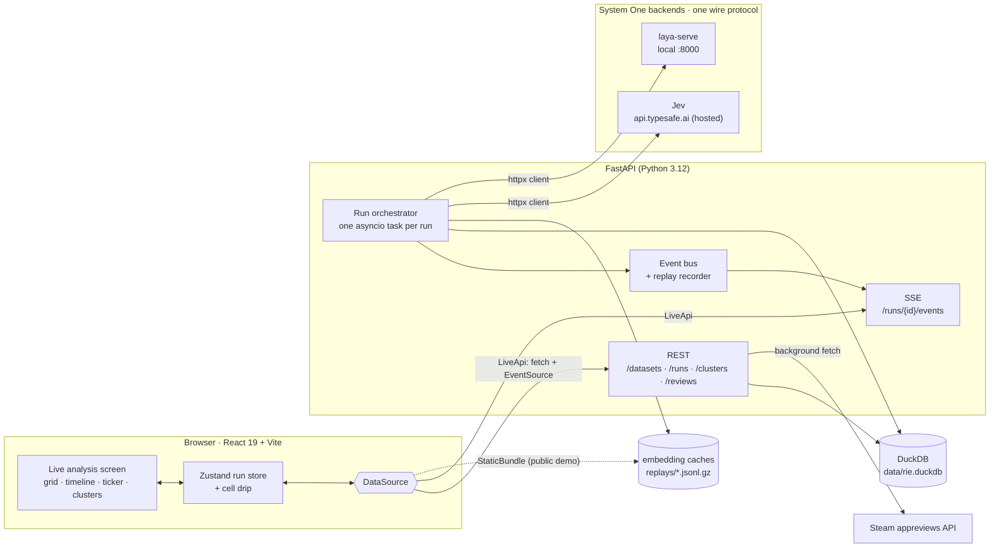
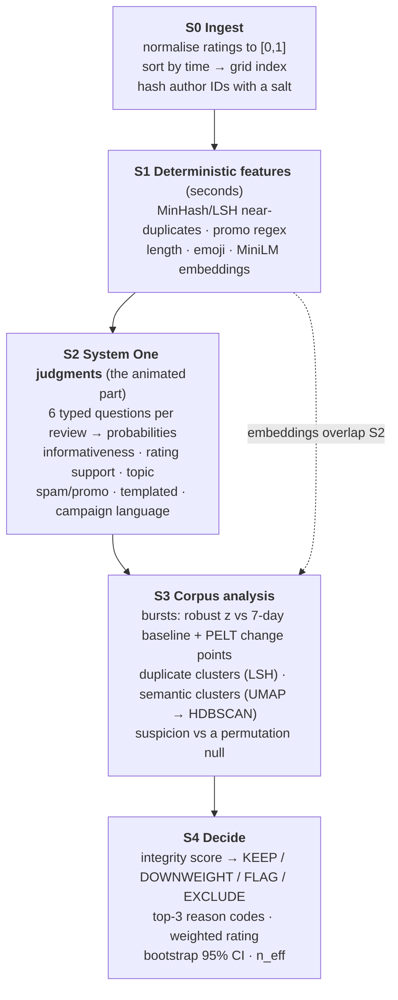
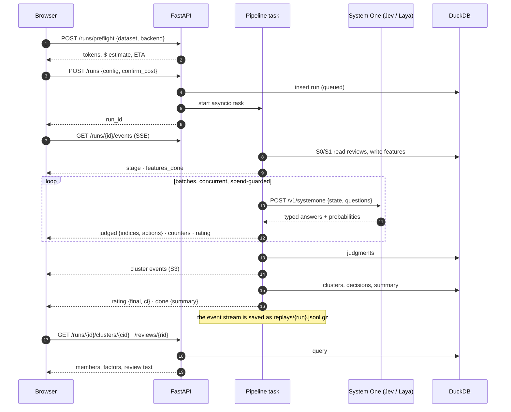
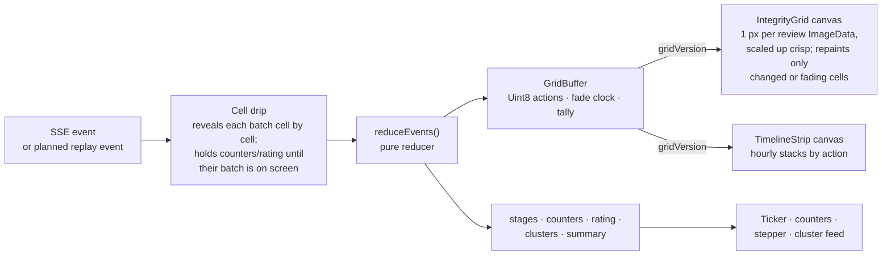

# Architecture

How the Rating Integrity Engine turns a review corpus into an integrity-adjusted rating, and how the live screen shows it happening. Design rationale lives in [`MVP_SPEC.md`](MVP_SPEC.md); measured numbers in [`MEASUREMENTS.md`](MEASUREMENTS.md).

## System overview

- **One client, two models.** Jev and `laya-serve` speak the same HTTP protocol, so switching backend changes `base_url` and `model`, not code (`backend/app/systemone/client.py`).
- **No queue.** A single-user app runs one asyncio task per run. Every event is recorded with its time offset, so a finished run can be replayed with no backend and no API key. That is how the public demo works.

## The pipeline (S0 → S4)

| Stage | Code | Output |
|---|---|---|
| S0 | `backend/app/ingest/` | `reviews` rows; `id` = chronological position = grid index |
| S1 | `backend/app/features/` | `features` rows; later copies marked (still judged) |
| S2 | `backend/app/systemone/` | `judgments` rows (versioned question sets, `questions_v*.py`) |
| S3 | `backend/app/corpus/` | `clusters`, `cluster_members`; every suspicion factor stored |
| S4 | `backend/app/decide/` | `decisions` rows; summary with raw, adjusted, CI, `n_eff` |

**Guardrails built into the design:**
- System One output alone can never EXCLUDE a review. Exclusion needs a deterministic signal: a copy inside a suspicious burst or cluster, or a high spam probability *confirmed* by the promo-link match. Spam judged by System One alone is FLAGged for a human.
- Every threshold and weight lives in the run config (`PolicyThresholds`, `ActionWeights`), and every run stores its full config, question-set version and pinned model version.
- Cluster suspicion is judged against random same-size subsets of the corpus, never the corpus-wide rate, because a cluster is itself a subset.
- Copies inside a suspicious burst or cluster are escalated. Copies outside one stay DOWNWEIGHT, so an organic complaint wave survives.

## Data flow of a run

Spending money is gated twice. Every Jev run goes through the pre-flight, and a run above `MAX_RUN_COST_USD` needs `confirm_cost: true`. A running spend guard also stops the run if the cost passes the approved estimate by a slack factor. Policy experiments reuse a finished run's answers through `backend: "cached"`, at $0.

## The live screen

- **Rendering budget.** 50K reviews replay at 60 fps, with grid paint p95 at 0.4 ms (MEASUREMENTS M10). Grid cells never go through React. Components subscribe to a version counter and read the mutable buffer directly.
- **Watchable by design.** Finished runs auto-play, and the grid fills in 30 s whatever the run's recorded pace. Each decision flashes in, and the rating moves with the cells that are visible.
- **Two data sources, one interface.** `LiveApi` talks to the backend (REST + `EventSource`). `StaticBundle` (Phase 9) plays exported bundles with no backend, for the public demo.

## Storage

| Store | Holds |
|---|---|
| `data/rie.duckdb` | datasets, reviews (hashed authors only), runs, features, judgments, clusters, decisions, labels. Access goes through `Database.cursor()` (UTC-pinned, thread-safe) |
| `data/cache/` | embedding caches (`.npy`) keyed by dataset and model |
| `data/replays/` | one `jsonl.gz` event recording per run |

`data/` and `.env` are never committed.
